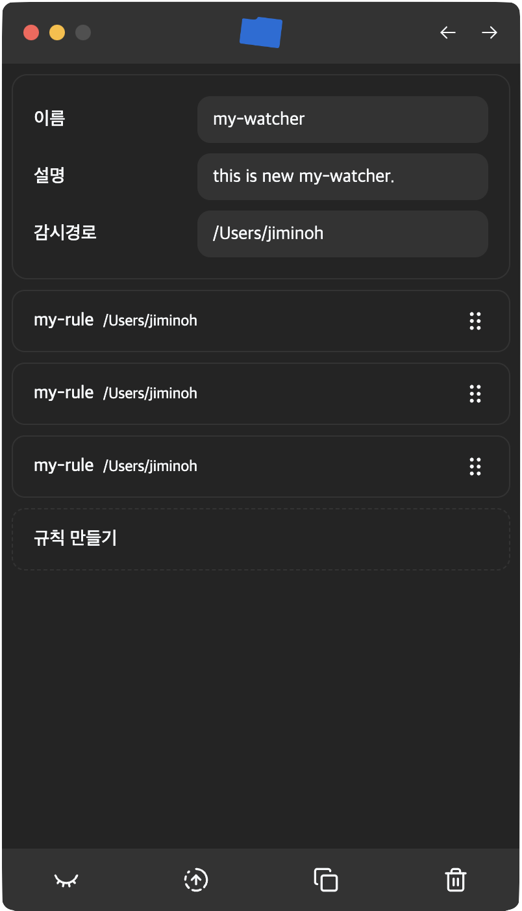
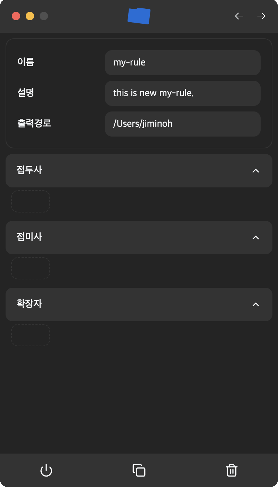

   
  

# 📋 개요

ReFolder는 사용자가 설정한 규칙에 따라서 정리되지 않은 폴더의 파일을 정리해주는 프로그램입니다.

## 🛠️ 기술스택

                   

## ⭐ 주요기능

### 1. 👁️ [감시자](#-감시자)

감지사는 정리되지 않은 폴더를 지속적으로 감시하여, 새로운 파일이 생기거나 파일의 이름이 변경된 경우 그 이름을 사용자가 설정한 규칙과 대조하여 파일이 있어야하는 적잘한 위치로 이동시킵니다. 항상 하나의 폴더에 모든 파일을 때려넣어 정리하는 사람에게 유용합니다.

### 2. 📁 [폴더 프리셋](#-폴더-프리셋)

폴더 프리셋은 사용자가 자주 사용하는 폴더의 구조를 미리 설정해 둘 수 있는 기능입니다. 반복적으로 프로젝트를 시작하는 사람이나, 새로운 프로젝트를 자주 시작하는 사람에게 유용합니다. 설정해둔 폴더의 구조를 사용자가 원하는 위치에 적용하면 그곳에 프리셋에서 설정한 구조대로 폴더가 생성됩니다.

## 👁️ 감시자

각 감시자는 다음을 포함합니다.

| 용어     | 설명                                                                                                                                                                                                                                                                                             |
| -------- | ------------------------------------------------------------------------------------------------------------------------------------------------------------------------------------------------------------------------------------------------------------------------------------------------ |
| 이름     | 사용자가 구분할 수 있는 감시자의 이름을 입력합니다. 유일한 이름일 필요는 없습니다.                                                                                                                                                                        |
| 설명     | 감시자가 어떤 역할을 하는지에 대한 설명을 적습니다. 사용자가 감시자를 구분하기 위해 설정하는 것으로 기능 작동과 무관합니다.                                                                                           |
| 감시경로 | 감시자가 감시할 폴더를 선택합니다.                                                                                                                                                                                                                           |
| 규칙들   | 감시자가 감시경로에서 파일 변경을 발견했을 때 적용할 규칙들을 순서대로 보여줍니다. 위에서부터 순차 적용되며, 먼저 만족하는 규칙이 사용됩니다. |

### 📋 규칙

각 규칙은 다음을 포함합니다.

| 용어     | 설명                                                                                                                                                                                               |
| -------- | -------------------------------------------------------------------------------------------------------------------------------------------------------------------------------------------------- |
| 이름     | 사용자가 구분할 수 있는 규칙의 이름을 입력합니다. 유일한 이름일 필요는 없습니다.                                                                            |
| 설명     | 규칙이 어떤 역할을 하는지에 대한 설명을 적습니다. 사용자가 규칙을 구분하기 위해 설정하는 것으로 기능 작동과 무관합니다. |
| 출력경로 | 파일이 이동될 경로를 선택합니다. 해당 규칙을 만족한 파일은 이 경로로 이동됩니다.                                        |
| 접두사   | 파일 이름이 해당 단어로 시작하면 규칙을 만족합니다.                                                                                                            |
| 접미사   | 파일 이름이 해당 단어로 끝나면 규칙을 만족합니다.                                                                                                              |
| 확장자   | 파일 확장자가 해당 단어와 일치하면 규칙을 만족합니다.                                                                      |

모든 조건(접두사, 접미사, 확장자)을 만족해야 규칙이 적용됩니다. 조건을 하나도 설정하지 않으면 해당 규칙은 적용되지 않습니다.

**예시:**

| 접두사      | 접미사         | 확장자 | 만족하는 파일 예시                     |
| ----------- | -------------- | ------ | -------------------------------------- |
| `project`   | `name`         | `md`   | `project-name.md`                      |
| `test`      | (없음)         | `txt`  | `test.txt`                             |
| `doc`       | `final`        | `pdf`  | `doc-final.pdf`                        |
| (없음)      | `backup`       | `zip`  | `file-backup.zip`                      |
| `img`       | (없음)         | `png`  | `img-screenshot.png`                   |
| `dev prod`  | (없음)         | `env`  | `dev.env`, `prod.env`                  |
| `config`    | `local` `dev`  | `json` | `config-local.json`, `config-dev.json` |
| `app` `web` | `test`         | `js`   | `app-test.js`, `web-test.js`           |
| `data`      | `backup` `old` | `csv`  | `data-backup.csv`, `data-old.csv`      |
