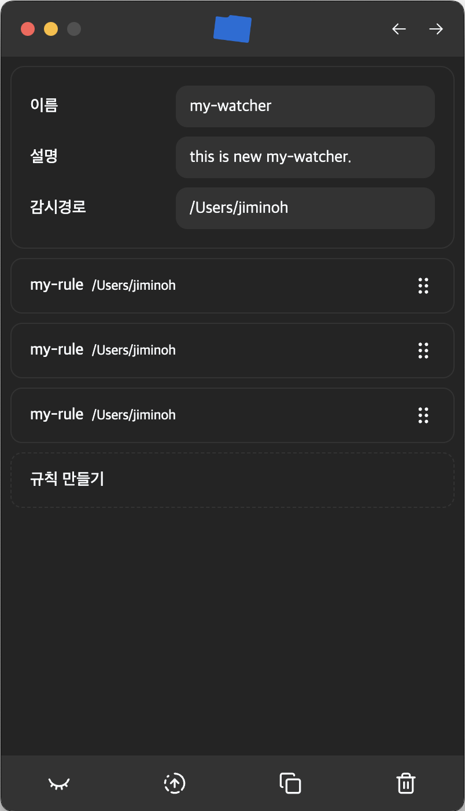
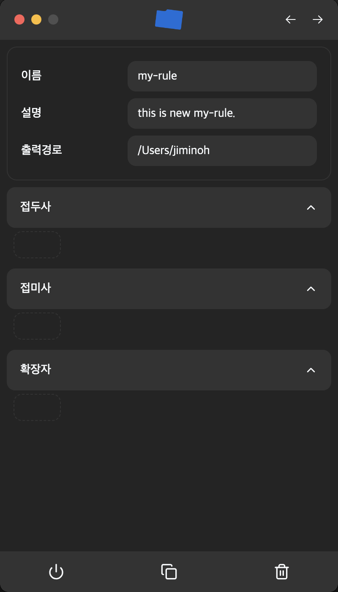
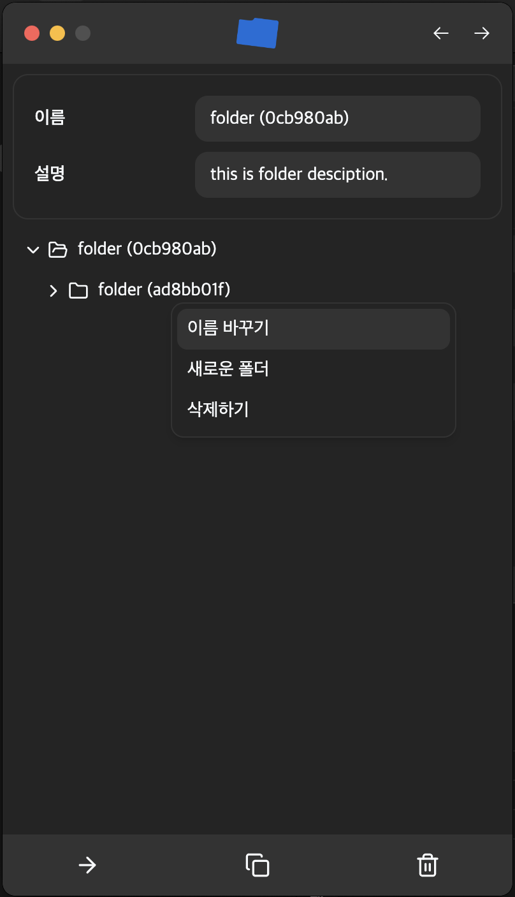

  
<h3>ReFolder</h3>

# 개요

ReFolder는 사용자가 설정한 규칙에 따라서 정리되지 않은 폴더의 파일을 정리해주는 프로그램입니다.

## 기술스택

- 
- 
- 
- 
- 

  NextJs와는 달리 Vite에는 파일기반 라우팅이 없습니다. 파일기반 라우팅과 TypeSafe한 라우팅을 위해서 TanStack Router를 사용했습니다. React Router와 달리 TypeSafe하다는 점, Vite과의 통합이 쉽다는 점 때문에 선택했습니다.

- 
- 

  손쉬운 데이터베이스 마이그레이션을 위해 사용합니다. 순수하게 sqlite를 직접 사용하거나, prisma orm의 사용도 고려했습니다. 하지만 drizzle-kit에서 제공하는 api중 런타임에 마이그레이션을 수행할 수 있어 배포된 후에도 보다 유연하게 사용자의 로컬 데이터베이스의 형태를 업데이트해줄 수 있다는 점에서 Drizzle을 선택했습니다.

- 

  앱 내부에서 사용하는 데이터베이스입니다. postgresql이나 mysql을 사용하는 것도 고려해 보았으나, 웹 어플리케이션과 달리 설치하는 프로그램의 형태로 배포중이고 데이터베이스 설정이 어려워 최대한 가볍고 설정이 쉬운 sqlite를 선택했습니다. 뿐만 아니라 sqlite로 제작할 경우 사용자가 설정한 규칙정보를 로컬에서 관리할 수 있어 편리합니다.

- 

  DB에 저장하지 않는 key-value 형태의 설정값들의 Schema를 관리하는데 사용합니다. 이미 앱이 배포된 상태에서 설정값의 Schema를 유연하게 변경하기 위해 주로 사용됩니다. Dizzle을 사용한 이유와 비슷합니다.

- 

  초기에 NextJs의 파일기반 라우팅이나, 각종 최적화 기능들을 Electron에서 사용하기 위해서 여러가지 방법을 시도해 보았습니다. 하지만 결국 NextJs의 핵심기능인 SSR이나 ISR기능이 Electron에서는 별로 의미가 없다는 점, 그리고 빌드과정이 오히려 복잡하고 통합적이지 못하다는 점 때문에 Vite을 선택하였습니다.

## 주요기능

### 1. 감시자

감지사는 정리되지 않은 폴더를 지속적으로 감시하여, 새로운 파일이 생기거나 파일의 이름이 변경된 경우 그 이름을 사용자가 설정한 규칙과 대조하여 파일이 있어야하는 적잘한 위치로 이동시킵니다. 항상 하나의 폴더에 모든 파일을 때려넣어 정리하는 사람에게 유용합니다.

### 2. 폴더 프리셋

폴더 프리셋은 사용자가 자주 사용하는 폴더의 구조를 미리 설정해 둘 수 있는 기능입니다. 반복적으로 프로젝트를 시작하는 사람이나, 새로운 프로젝트를 자주 시작하는 사람에게 유용합니다. 설정해둔 폴더의 구조를 사용자가 원하는 위치에 적용하면 그곳에 프리셋에서 설정한 구조대로 폴더가 생성됩니다.

## 감시자

각각의 감시자는 다음을 포함합니다.

- 감시자의 이름

  사용자가 구분할 수 있는 감시자의 이름을 입력합니다. 유일한 이름일 필요는 없습니다.

- 감시자의 설명

  감시자가 어떤 역할을 하는지에 대한 설명을 적습니다. 사용자가 감시자를 구분하기 위해 설정하는 것으로 기능의 작동과 무관합니다.

- 감시경로

  감시자가 감시할 폴더를 선택합니다.

- 감시자의 규칙들

  감시자가 감시경로에서 이름이 변경된 파일이나, 새롭게 추가된 파일을 발견했을 때 적용할 규칙들을 순서대로 보여줍니다. 각 규칙들은 위에서 부터 아래로 순차적으로 적용되며, 먼저 만족하는 규칙이 사용됩니다. ( First Match Use )

### 규칙

각 규칙은 다음을 포함합니다.

- 규칙의 이름

  사용자가 구분할 수 있는 규칙의 이름을 입력합니다. 유일한 이름일 필요는 없습니다.

- 규칙의 설명

  규칙이 어떤 역할을 하는지에 대한 설명을 적습니다. 사용자가 규칙을 구분하기 위해 설정하는 것으로 기능의 작동과 무관합니다.

- 출력경로

  파일이 이동될 경로를 선택합니다. 해당 규칙을 만족한 파일은 이 경로로 이동됩니다.

- 접두사

  감시자가 감지한 파일의 이름이 해당 단어로 시작한다면 이 규칙을 만족한 것으로 간주합니다. 예를 들어 접두사를 `project`라고 설정하면 `project-name`이라는 이름의 파일이 감지되면 이 규칙을 만족한 것으로 간주합니다. 설정된 접두사가 여러개일 경우 설정된 접두사중 하나만 만족해도 접두사 규칙을 만족한 것으로 간주합니다.

- 접미사

  감시자가 감지한 파일의 이름이 해당 단어로 끝난다면 이 규칙을 만족한 것으로 간주합니다. 예를 들어 접미사를 `name`라고 설정하면 `project-name.md`이라는 이름의 파일이 감지되면 이 규칙을 만족한 것으로 간주합니다. 설정된 접미사가 여러개일 경우 설정된 접미사중 하나만 만족해도 접미사 규칙을 만족한 것으로 간주합니다.

- 확장자

  감시자가 감지한 파일의 확장자가 해당 단어와 일치하면 이 규칙을 만족한 것으로 간주합니다. 예를 들어 확장자를 `md`라고 설정하면 `project-name.md`이라는 이름의 파일이 감지되면 이 규칙을 만족한 것으로 간주합니다. 설정된 확장자가 여러개일 경우 설정된 확장자중 하나만 만족해도 확장자 규칙을 만족한 것으로 간주합니다.

> **Note** \
> 접두사, 접미사, 확장자에 아무것도 입력하지 않은 경우, 이 규칙을 만족하는 파일은 존재하지 않습니다.

> **Note** \
> 규칙을 만족한다는 것은 접두사, 접미사, 확장자 규칙 모두를 만족하는 것을 의미합니다. 만약 접두사가 `project`, `test`이고, 접미사가 `name`, `space`이고, 확장자가 `md`, `png`인 경우 `project-name.md`라는 이름의 파일이 감지되면 이 규칙을 만족한 것으로 간주합니다. 파일의 이름이 `project-name.txt`인 경우 이 규칙을 만족하지 않습니다.

## 폴더 프리셋

각 폴더 프리셋은 다음을 포함합니다.

- 폴더 프리셋의 이름

  사용자가 구분할 수 있는 폴더 프리셋의 이름을 입력합니다. 유일한 이름일 필요는 없습니다.

- 폴더 프리셋의 설명

  폴더 프리셋이 어떤 역할을 하는지에 대한 설명을 적습니다. 사용자가 폴더 프리셋을 구분하기 위해 설정하는 것으로 기능의 작동과 무관합니다.

- 폴더 프리셋의 구조

  폴더 프리셋의 구조를 설정합니다. 폴더 프리셋의 구조는 폴더의 이름과 폴더의 위치로 이루어집니다. 각각의 폴더는 이름을 바꾸거나 하위에 새로운 폴더를 추가할 수 있으며, 삭제될 수 있습니다. OS의 탐색기와 같이 상위 폴더를 삭제하면 하위의 폴더도 함께 제거됩니다.
